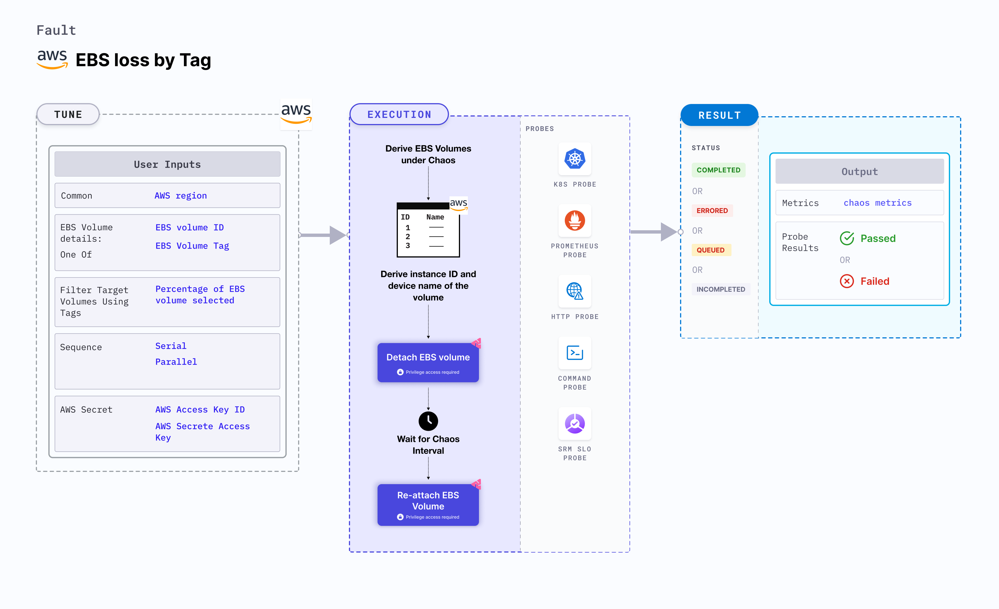

EBS loss by tag disrupts the state of EBS volume by detaching it from the node (or EC2) instance using volume ID for a certain duration.
- In case of EBS persistent volumes, the volumes can self-attach and the re-attachment step can be skipped.
- It tests the deployment sanity (replica availability and uninterrupted service) and recovery workflows of the application pod.





## Usage

<details>
<summary>View fault usage</summary>
<div>
It tests the deployment sanity (replica availability and uninterrupted service) and recovery workflows of the application pod.
</div>
</details>

## Prerequisites
- Kubernetes > 1.16.
- Adequate AWS access to attach or detach an EBS volume for the instance. 
- Create a Kubernetes secret that has the AWS access configuration(key) in the `CHAOS_NAMESPACE`. A sample secret file looks like:
```yaml
apiVersion: v1
kind: Secret
metadata:
  name: cloud-secret
type: Opaque
stringData:
  cloud_config.yml: |-
    # Add the cloud AWS credentials respectively
    [default]
    aws_access_key_id = XXXXXXXXXXXXXXXXXXX
    aws_secret_access_key = XXXXXXXXXXXXXXX
```
- If you change the secret key name (from `cloud_config.yml`), ensure that you update the `AWS_SHARED_CREDENTIALS_FILE` environment variable in the chaos experiment with the new name.

## Permissions required

Here is an example AWS policy to execute the fault.

<details>
<summary>View policy for the fault</summary>

```json
{
    "Version": "2012-10-17",
    "Statement": [
        {
            "Effect": "Allow",
            "Action": [
                "ec2:AttachVolume",
                "ec2:DetachVolume"
            ],
            "Resource": "*"
        },
        {
            "Effect": "Allow",
            "Action": "ec2:DescribeVolumes",
            "Resource": "*"
        },
        {
            "Effect": "Allow",
            "Action": [
                "ec2:DescribeInstanceStatus",
                "ec2:DescribeInstances"
            ],
            "Resource": "*"
        }
    ]
}
```
</details>

Refer to the [superset permission/policy](./policy-for-all-aws-faults) to execute all AWS faults.

## Default validations

EBS volume is attached to the instance.

## Fault tunables

<details>
    <summary>Fault tunables</summary>
    <h2>Mandatory fields</h2>
    <table>
      <tr>
        <th> Variables </th>
        <th> Description </th>
        <th> Notes </th>
      </tr>
      <tr>
        <td> EBS_VOLUME_TAG </td>
        <td> Provide the common tag for target volumes. It'll be in form of <code>key:value</code> (Ex: 'team:devops')</td>
        <td> </td>
      </tr>
      <tr>
        <td> REGION </td>
        <td> The region name for the target volumes</td>
        <td> For example, <code>us-east-1</code>. </td>
      </tr>
    </table>
    <h2>Optional fields</h2>
    <table>
      <tr>
        <th> Variables </th>
        <th> Description </th>
        <th> Notes </th>
      </tr>
       <tr>
        <td> VOLUME_AFFECTED_PERC </td>
        <td> The Percentage of total EBS volumes to target </td>
        <td> Defaults to 0 (corresponds to 1 volume), provide numeric value only </td>
      </tr>
      <tr>
        <td> TOTAL_CHAOS_DURATION </td>
        <td> The time duration for chaos insertion (sec) </td>
        <td> Defaults to 30s </td>
      </tr>
      <tr>
        <td> CHAOS_INTERVAL </td>
        <td> The time duration between the attachment and detachment of the volumes (sec) </td>
        <td> Defaults to 30s </td>
      </tr>
      <tr>
        <td> SEQUENCE </td>
        <td> It defines sequence of chaos execution for multiple volumes</td>
        <td> Default value: parallel. Supported: serial, parallel </td>
      </tr>
      <tr>
        <td> RAMP_TIME </td>
        <td> Period to wait before and after injection of chaos in sec </td>
        <td> For example, 30 </td>
      </tr>
    </table>
</details>

## Fault examples

### Common and AWS-specific tunables

Refer to the [common attributes](../common-tunables-for-all-faults) and [AWS-specific tunables](./aws-fault-tunables) to tune the common tunables for all faults and aws specific tunables.

### Target single volume

It will detach a random single EBS volume with the given `EBS_VOLUME_TAG` tag and `REGION` region.

Use the following example to tune this:

[embedmd]:# (./static/manifests/ebs-loss-by-tag/ebs-volume-tag.yaml yaml)
```yaml
# contains the tags for the EBS volumes 
apiVersion: litmuschaos.io/v1alpha1
kind: ChaosEngine
metadata:
  name: engine-nginx
spec:
  engineState: "active"
  chaosServiceAccount: litmus-admin
  experiments:
  - name: ebs-loss-by-tag
    spec:
      components:
        env:
        # tag of the EBS volume
        - name: EBS_VOLUME_TAG
          value: 'key:value'
        # region for the EBS volume
        - name: REGION
          value: 'us-east-1'
        - name: TOTAL_CHAOS_DURATION
          VALUE: '60'
```

### Target percent of volumes

It will detach the `VOLUME_AFFECTED_PERC` percentage of EBS volumes with the given `EBS_VOLUME_TAG` tag and `REGION` region.

Use the following example to tune it:

[embedmd]:# (./static/manifests/ebs-loss-by-tag/volume-affected-percentage.yaml yaml)
```yaml
# target percentage of the EBS volumes with the provided tag
apiVersion: litmuschaos.io/v1alpha1
kind: ChaosEngine
metadata:
  name: engine-nginx
spec:
  engineState: "active"
  chaosServiceAccount: litmus-admin
  experiments:
  - name: ebs-loss-by-tag
    spec:
      components:
        env:
        # percentage of EBS volumes filter by tag
        - name: VOLUME_AFFECTED_PERC
          value: '100'
        # tag of the EBS volume
        - name: EBS_VOLUME_TAG
          value: 'key:value'
        # region for the EBS volume
        - name: REGION
          value: 'us-east-1'
        - name: TOTAL_CHAOS_DURATION
          VALUE: '60'
```
