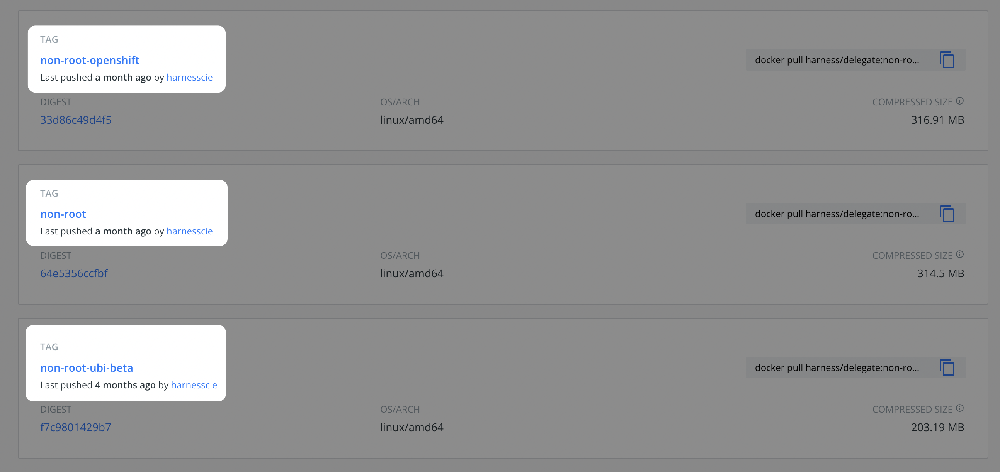

By default, Harness delegates use root access. You can install a different Docker image tag of the delegate if you want to install and run the delegate as non-root.

Delegate images are publicly hosted on [Docker Hub](https://hub.docker.com/r/harness/delegate/tags). This topic describes how to install and run a delegate as non-root.

### Before you begin

* [Delegate Requirements and Limitations](/docs/platform/2_Delegates/get-started-with-delegates/delegate-requirements-and-limitations.md)
* [Delegate Installation Overview](/docs/platform/2_Delegates/get-started-with-delegates/delegate-installation-overview.md)

### Limitations

* The Harness Delegate does NOT require root account access. Kubernetes and Docker Delegates run as root by default.
* If you do not run the Delegate as root, be aware that you cannot install any software using a [Delegate Initialization Script](/docs/platform/2_Delegates/delegate-reference/common-delegate-profile-scripts.md).

### Step 1: Download the Delegate Config File

Download the Delegate config file as part of its installation.

For examples, see:

* [Install a Docker Delegate](/docs/platform/2_Delegates/install-delegates/docker-delegates/install-a-docker-delegate.md)
* [Install a Kubernetes Delegate](/docs/platform/2_Delegates/advanced-installation/install-a-kubernetes-delegate.md)

### Option: Pick a Non-Root Type

Harness Delegate images are publicly hosted on [Docker Hub](https://hub.docker.com/r/harness/delegate/tags) and Harness has non-root options for different platforms:


Unless you are using OpenShift or a Universal Base Image (UBI), you will want to use to use `delegate:non-root`.

### Step 2: Update the Delegate Image

In the Delegate config file, update the image tag to use the non-root image: `harness/delegate:non-root`.

For example, here's the Docker Delegate config file updated:


```
version: "3.7"  
services:  
  harness-ng-delegate:  
    restart: unless-stopped  
    deploy:  
      resources:  
        limits:  
          cpus: "0.5"  
          memory: 2048M  
    image: harness/delegate:non-root  
    environment:  
      - ACCOUNT_ID=xxx  
      - DELEGATE_TOKEN=xxx  
      - MANAGER_HOST_AND_PORT=https://app.harness.io  
      - WATCHER_STORAGE_URL=https://app.harness.io/public/prod/premium/watchers  
...
```
Here's the Kubernetes Delegate config file updated:


```
...  
---  
  
apiVersion: apps/v1  
kind: StatefulSet  
metadata:  
  labels:  
    harness.io/name: foo  
  name: foo  
  namespace: harness-delegate-ng  
spec:  
  replicas: 1  
  podManagementPolicy: Parallel  
  selector:  
    matchLabels:  
      harness.io/name: foo  
  serviceName: ""  
  template:  
    metadata:  
      labels:  
        harness.io/name: foo  
    spec:  
      containers:  
      - image: harness/delegate:non-root  
        imagePullPolicy: Always  
        name: harness-delegate-instance  
        ports:  
          - containerPort: 8080  
  
...
```
### Step 3: Install the Delegate

Install the Delegate as described in topics such as the following:

* [Install a Docker Delegate](/docs/platform/2_Delegates/install-delegates/docker-delegates/install-a-docker-delegate.md)
* [Install a Kubernetes Delegate](/docs/platform/2_Delegates/advanced-installation/install-a-kubernetes-delegate.md)

### See also

* [Automate Delegate Installation](/docs/platform/2_Delegates/advanced-installation/automate-delegate-installation.md)

