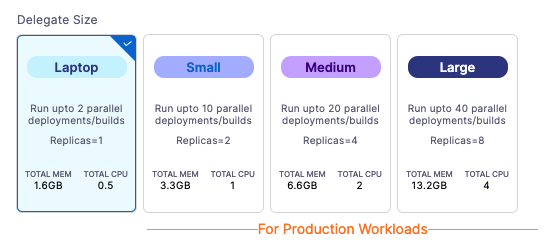

This topic describes the basic requirements of Harness Delegate.

* Deployment limits are set by account type.

* You might need to install multiple delegates depending on how many continuous delivery tasks you do concurrently, and on the number of compute resources you provide to each delegate. Typically, you need one delegate for every 300 to 500 service instances across your applications.  

	A service instance is created when you use Harness to deploy the underlying infrastructure for the instance.  

	For example, a service instance is an instance of a Kubernetes workload for which Harness creates the pods, or an instance of an ECS task for which Harness creates the service that performs the task.

* The delegate is installed in your network and connects to Harness Manager.

  
  
  The requirements for memory and CPU support only the delegate. The delegate host, pod, and container require additional compute resources to support operations, systems, and services such as Docker or Kubernetes.

  The delegate runs in a Linux/UNIX container.

* The minimum memory for the delegate must be provided in addition to enough memory for the host/node system. For example, an AWS EC2 instance type like m5a.xlarge could require 16 GB of RAM; 8 GB for the delegate and 8 GB for the remaining operations.

* The Shell Script delegate requires cURL 7.64.1 or later.

* Access to artifact servers, deployment environments, and cloud providers is required, as shown in the following illustration:

## Allowlist Harness domains and IP addresses

Harness delegates in SaaS environments require only outbound access to the Harness domain name &mdash; most commonly, **app.harness.io** &mdash; and optionally, to **logging.googleapis.com**. The **logging.googleapis.com** URL provides logs to Harness Support.

Go to [Allowlist Harness Domains and IPs](/docs/platform/20_References/whitelist-harness-domains-and-ips.md).

## Network requirements

The following requirements support the connection of the delegate you run in your network to Harness Manager (SaaS or Self-Managed Enterprise Edition), and the connection of your browser to Harness Manager.

:::note
Network connections from your local network to Harness SaaS are restricted to the outbound direction.
:::

The requirements include:

* HTTPS port 443 outbound from the delegate to Harness.
 
* Delegate API access and communication over SSH and HTTP to the providers you add to Harness. These include but are not limited to the following:

	+ Cloud Providers
	+ Verification Providers
	+ Artifact Servers (repositories)
	+ Source repositories
	+ Collaboration providers
	+ SSH access to target physical and virtual servers

### gRPC limitations

If you do not enable gRPC connections, the following limitations apply:

* [Cloud Cost Management (CCM)](/docs/category/cloud-cost-management) does not collect events.

## Add certificates and other software to the delegate

For information about how to add certificates or other software to the delegate, go to [Common Delegate Initialization Scripts](/docs/platform/2_Delegates/delegate-reference/common-delegate-profile-scripts.md).

## Delegate access requirements

Before you install a delegate, consider the following:

* Delegates do not require root account access. Kubernetes and Docker delegates do, however, run as root by default. If you do not need to install applications during the initialization process (`INIT_SCRIPT`), you can use a non-root account or install the application without the delegate.  
See [Delegate installation overview](/docs/platform/2_Delegates/get-started-with-delegates/delegate-installation-overview.md).

* If you do not run the delegate as root, you cannot use [delegate initialization scripts](/docs/platform/2_Delegates/delegate-reference/common-delegate-profile-scripts.md) to install software.

For more information, see [Delegate installation overview](/docs/platform/2_Delegates/get-started-with-delegates/delegate-installation-overview.md).

